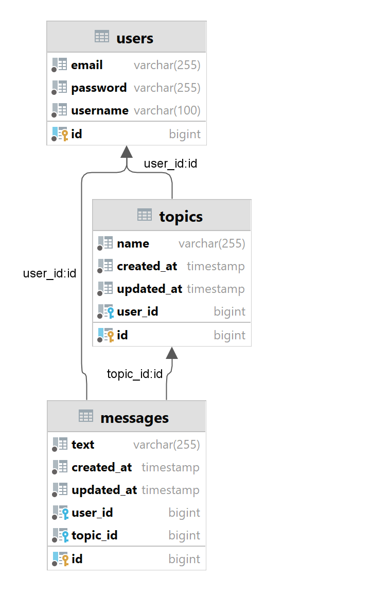

# MessageBoardEngine

Приложение предоставляет пользователям возможность размещать свои темы на доске объявлений 
и оставлять сообщения в этих темах, а также в темах других пользователей.

Вы можете получить доступ к Swagger и просмотреть все доступные эндпоинты, посетив `http://localhost:8080/swagger-ui/index.html`

## Диаграмма классов

Основные классы: **User**, **Message**, **Topic**

**User** может публиковать темы и сообщения.

В каждой теме (**Topic**) может быть несколько сообщений(**Message**).

